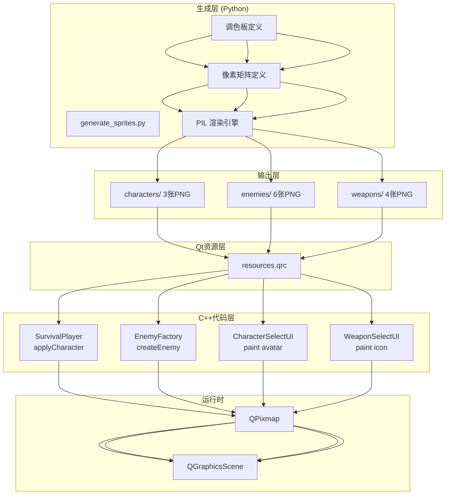
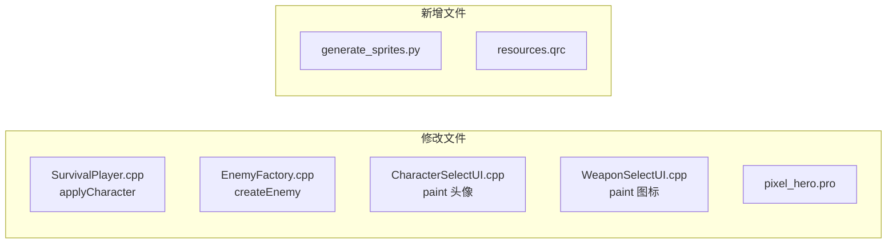
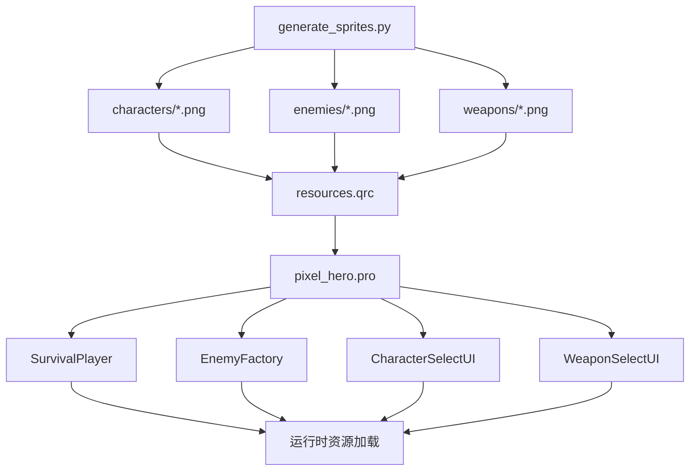

# 像素美术升级 — DESIGN 设计文档

**项目**: 像素勇者 (Pixel Hero Adventure)
**文档版本**: DESIGN V1.0
**日期**: 2026-06-11
**阶段**: 阶段2 — 架构阶段 (Architect)
**前置文档**: [CONSENSUS_像素美术升级.md](./CONSENSUS_像素美术升级.md)

---

## 一、整体架构图



---

## 二、分层设计

### 2.1 生成层: generate_sprites.py

```
generate_sprites.py
├── Palette 定义 (每个精灵的调色板)
│   ├── {} encode (结构化)
│   └── 颜色编号: 0=主体, 1=暗面, 2=高光, 3=细节, 4=轮廓
│
├── Pixel Matrix 定义 (每个精灵的像素矩阵)
│   ├── {} "RLE-风格" 编码: 字符串每行表示颜色
│   └── 空格 = 透明, 数字0-4 = palette[数字]
│
├── Rendering Engine
│   ├── render_sprite(palette, pixel_map, scale)
│   │     ├── 解析字符串 → 像素坐标
│   │     ├── Palette RGB → RGBA PNG
│   │     └── NEAREST 整数倍放大
│   └── save_png(path)
│
└── Main
    ├── 定义所有13个精灵
    └── 循环渲染 → 输出到 resources/png/
```

### 2.2 Qt资源层: resources.qrc

```xml
<RCC>
    <qresource prefix="/sprites/characters">
        <file>resources/png/characters/warrior.png</file>
        <file>resources/png/characters/archer.png</file>
        <file>resources/png/characters/mage.png</file>
    </qresource>
    <qresource prefix="/sprites/enemies">
        <file>resources/png/enemies/slime.png</file>
        <file>resources/png/enemies/goblin.png</file>
        <file>resources/png/enemies/skeleton.png</file>
        <file>resources/png/enemies/bat.png</file>
        <file>resources/png/enemies/goblin_elite.png</file>
        <file>resources/png/enemies/dragon.png</file>
    </qresource>
    <qresource prefix="/sprites/weapons">
        <file>resources/png/weapons/short_sword.png</file>
        <file>resources/png/weapons/long_sword.png</file>
        <file>resources/png/weapons/staff.png</file>
        <file>resources/png/weapons/dagger.png</file>
    </qresource>
</RCC>
```

### 2.3 C++集成层



**改动对照**:

| 文件 | 原代码 | 改后 |
|------|--------|------|
| SurvivalPlayer.cpp | `setPixmap(QPixmap(48,48).fill(ch.color))` | `setPixmap(QPixmap(":/sprites/characters/warrior.png"))` |
| EnemyFactory.cpp | `enemy->setPixmap(QPixmap(32,32).fill(color))` | `enemy->setPixmap(QPixmap(":/sprites/enemies/slime.png"))` |
| CharacterSelectUI.cpp | `painter->fillRect(avatarRect, ch.color)` | `painter->drawPixmap(avatarRect.topLeft(), QPixmap(":/sprites/...")))` |
| WeaponSelectUI.cpp | `painter->fillRect(iconRect, wp.color)` | `painter->drawPixmap(iconRect.topLeft(), QPixmap(":/sprites/...")))` |
| pixel_hero.pro | 无 QRC | `RESOURCES += resources.qrc` |

---

## 三、模块依赖关系



---

## 四、精灵像素设计 (逐像素概览)

### 4.1 史莱姆 (32×32) — 颜色码: 0=蓝体 #0080FF, 1=暗面 #0050AA, 2=高光 #66CCFF, 3=眼睛白 #FFFFFF, 4=瞳孔 #000000

```
      1111111
     100000001
    10033333001
   103333333301
   100333333001
  1003333333001
  1003333333001
 10033333333001
 10033333333001
 10003333333001
  100033333001
  10000000001
   111111111
```

(实际脚本中每像素明确定义)

### 4.2 哥布林 (48×48) — 颜色码: 0=绿皮 #4CAF50, 1=深绿 #2E7D32, 2=棕甲 #8B4513, 3=眼睛 #FF0000

- 矮小驼背体型
- 尖耳朵 + 红眼
- 棕色破皮甲
- 手持小木棒(右手)

### 4.3 骷髅 (48×48) — 颜色码: 0=骨白 #F5F5DC, 1=骨暗 #C0C0A0, 2=眼窝 #000000, 3=剑金属 #C0C0C0

- 完整骨骼结构
- 黑色空心眼窝
- 右手持骨剑
- 可添加简单盔甲残片(深灰)

### 4.4 蝙蝠 (32×48) — 颜色码: 0=深紫体 #4A148C, 1=翼膜 #7B1FA2, 2=红眼 #FF0000, 3=翼骨 #311B92

- 展开双翼形态
- 身体较小居中
- 红色发光眼睛
- 翼展约 48px 宽

### 4.5 精英哥布林 (64×64) — 颜色码: 0=红皮 #D32F2F, 1=暗红 #B71C1C, 2=金属甲 #757575, 3=金边 #FFD700

- 比哥布林大1.5倍
- 金属肩甲 + 金色镶边
- 手持大斧
- 更粗壮的体型

### 4.6 龙 (128×128) — 颜色码: 0=暗鳞 #37474F, 1=鳞光 #546E7A, 2=红眼 #FF5722, 3=腹甲 #FFCC80

- 双足站立的龙形
- 展开的蝙蝠翅膀
- 长尾
- 口中火光暗示
- 红色发光眼睛

### 4.7-4.9 角色 (48×48)

| 战士 | 蓝白盔甲+剑盾+头盔 |
| 弓箭手 | 绿装+兜帽+弓 |
| 法师 | 紫袍+尖帽+法杖 |

### 4.10-4.13 武器图标 (32×32)

简单线条+填充的武器轮廓：短剑/长剑/法杖/匕首

---

## 五、异常处理策略

| 场景 | 处理 |
|------|------|
| PNG 文件不存在 | 保持原纯色方块作为 fallback |
| Python 未安装 | 预生成 PNG 已提交到仓库，无需运行时安装 Python |
| PIL 加载失败 | Python 脚本报错退出，提示安装 `pip install Pillow` |
| QRC 资源找不到 | 编译失败，qmake 会报错 |
| 精灵尺寸超出预期 | 中代码用 `scaled()` 适配，但首选精确输出 |

---

**文档状态**: ✅ DESIGN 完成，可进入阶段3(Atomize)
