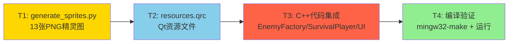

# 像素美术升级 — TASK 原子任务文档

**项目**: 像素勇者 (Pixel Hero Adventure)
**文档版本**: TASK V1.0
**日期**: 2026-06-11
**阶段**: 阶段3 — 原子化阶段 (Atomize)
**前置文档**: [DESIGN_像素美术升级.md](./DESIGN_像素美术升级.md)

---

## 一、任务拆分总览

```
T1_generate_sprites.py ── T2_resources.qrc ── T3_C++集成 ── T4_编译验证
```

## 二、任务依赖图



---

## 三、原子任务详述

---

### Task 1: `generate_sprites.py` — Python PIL 像素精灵生成脚本

| 属性 | 内容 |
|------|------|
| **优先级** | P0 |
| **依赖** | 无 |
| **操作** | 新建文件 |

#### 输入

| 项 | 值 |
|------|-----|
| Python | 3.x + Pillow (`pip install Pillow`) |
| 输出目录 | `pixel_hero/resources/png/characters/`, `enemies/`, `weapons/` |
| 精灵定义 | 13组 (调色板 + 像素矩阵) |

#### 输出

`pixel_hero/scripts/generate_sprites.py` (约 200-300 行)

**结构**:
```
Palette definitions (每个精灵 5 色 RGBA)
  ↓
Pixel matrices (每像素颜色索引, -1=透明)
  ↓
render_sprite(palette, matrix, scale) → PIL Image
  ↓
save_png(path)
  ↓
main() 循环生成 13 张 PNG
```

**PNG 输出清单**:

| 文件路径 | 尺寸 | 内容 |
|------|------|------|
| `resources/png/characters/warrior.png` | 48×48 | 战士 |
| `resources/png/characters/archer.png` | 48×48 | 弓箭手 |
| `resources/png/characters/mage.png` | 48×48 | 法师 |
| `resources/png/enemies/slime.png` | 32×32 | 史莱姆 |
| `resources/png/enemies/goblin.png` | 48×48 | 哥布林 |
| `resources/png/enemies/skeleton.png` | 48×48 | 骷髅 |
| `resources/png/enemies/bat.png` | 48×48 | 蝙蝠 |
| `resources/png/enemies/goblin_elite.png` | 64×64 | 精英哥布林 |
| `resources/png/enemies/dragon.png` | 128×128 | 龙Boss |
| `resources/png/weapons/short_sword.png` | 32×32 | 短剑 |
| `resources/png/weapons/long_sword.png` | 32×32 | 长剑 |
| `resources/png/weapons/staff.png` | 32×32 | 法杖 |
| `resources/png/weapons/dagger.png` | 32×32 | 匕首 |

#### 验收

- [ ] 脚本运行成功，产出 13 张 PNG
- [ ] PNG 均为 RGBA 透明背景
- [ ] 每个精灵尺寸符合规范
- [ ] 用 NEAREST 放大，无抗锯齿模糊
- [ ] 精灵视效可辨识 (能看出是什么怪物/角色/武器)

---

### Task 2: `resources.qrc` — Qt 资源文件

| 属性 | 内容 |
|------|------|
| **优先级** | P0 |
| **依赖** | Task 1 (PNG 已存在) |
| **操作** | 新建文件 + 修改 .pro |

#### 输入

| 项 | 值 |
|------|-----|
| PNG 文件 | Task 1 产出的 13 张 PNG |
| .pro 文件 | `pixel_hero/pixel_hero.pro` |

#### 输出

| 文件 | 说明 |
|------|------|
| `pixel_hero/resources.qrc` | Qt 资源文件，映射路径前缀 `:/sprites/` |
| `pixel_hero/pixel_hero.pro` (修改) | 添加 `RESOURCES += resources.qrc` |

#### QRC 结构

```xml
<RCC>
    <qresource prefix="/sprites/characters">...</qresource>
    <qresource prefix="/sprites/enemies">...</qresource>
    <qresource prefix="/sprites/weapons">...</qresource>
</RCC>
```

#### 验收

- [ ] `resources.qrc` 文件存在且路径正确
- [ ] `.pro` 添加 `RESOURCES += resources.qrc`
- [ ] qmake 解析 QRC 无错误

---

### Task 3: C++ 代码集成 — 精灵图替换纯色方块

| 属性 | 内容 |
|------|------|
| **优先级** | P0 |
| **依赖** | Task 2 (QRC 就绪) |
| **操作** | 修改 4 个 C++ 文件 |

#### 3.1 Enemy.cpp — 敌人精灵替换

**修改文件**: `src/entities/Enemy.cpp`
**改动内容**: 每个 EnemyType case 中，`enemyPixmap = QPixmap(XX,XX).fill(color)` → `enemyPixmap = QPixmap(":/sprites/enemies/xxx.png")`

| Type | 原代码 | 新代码 | 尺寸变化 |
|------|--------|--------|---------|
| SLIME | `QPixmap(40,40).fill(green)` | `":/sprites/enemies/slime"` | 40→32 |
| GOBLIN | `QPixmap(40,40).fill(brown)` | `":/sprites/enemies/goblin"` | 40→48 |
| SKELETON | `QPixmap(40,40).fill(gray)` | `":/sprites/enemies/skeleton"` | 40→48 |
| BAT | `QPixmap(40,40).fill(purple)` | `":/sprites/enemies/bat"` | 40→48 |
| ELITE | `QPixmap(48,48).fill(red)` | `":/sprites/enemies/goblin_elite"` | 48→64 |
| DRAGON | `QPixmap(64,64).fill(darkred)` | `":/sprites/enemies/dragon"` | 64→128 |

**关键注意**: 精灵尺寸变化 → Enemy 的 `setOffset(-w/2, -h)` 在构造函数末尾已使用 `boundingRect()`，会自动适配。

#### 3.2 SurvivalPlayer.cpp — 角色精灵替换

**修改文件**: `src/survival/SurvivalPlayer.cpp`
**改动内容**: `applyCharacter()` 中:

```cpp
// 原代码:
QPixmap pixmap(48, 48);
pixmap.fill(cfg.color);
setPixmap(pixmap);

// 新代码:
QString spritePath = QString(":/sprites/characters/%1.png").arg(cfg.id);
setPixmap(QPixmap(spritePath));
```

**映射**: `warrior`→warrior.png, `archer`→archer.png, `mage`→mage.png

#### 3.3 CharacterSelectUI.cpp — 头像精灵替换

**修改文件**: `src/ui/CharacterSelectUI.cpp`
**改动内容**: `paint()` 中 `painter->fillRect(avatar, ch.color)` → `painter->drawPixmap(avatar.topLeft(), QPixmap(":/sprites/characters/xxx.png"))`

```cpp
// 原代码:
painter->setBrush(ch.color);
painter->drawRoundedRect(avatar, 8, 8);

// 新代码:
QPixmap sprite(QString(":/sprites/characters/%1.png").arg(ch.id));
painter->drawPixmap(
    QPointF(avatar.left() + (avatar.width() - sprite.width()) / 2,
            avatar.top()  + (avatar.height() - sprite.height()) / 2),
    sprite);
```

#### 3.4 WeaponSelectUI.cpp — 武器图标替换

**修改文件**: `src/ui/WeaponSelectUI.cpp`
**改动内容**: `paint()` 中 `painter->fillRect(icon, wp.color)` → `painter->drawPixmap(icon.topLeft(), QPixmap(":/sprites/weapons/xxx.png"))`

```cpp
// 原代码:
painter->setBrush(wp.color);
painter->drawRoundedRect(icon, 10, 10);

// 新代码:
QPixmap wpIcon(QString(":/sprites/weapons/%1.png").arg(wp.id));
painter->drawPixmap(
    QPointF(icon.left() + (icon.width() - wpIcon.width()) / 2,
            icon.top()  + (icon.height() - wpIcon.height()) / 2),
    wpIcon);
```

**注意**: WeaponData 结构体需要确认有 `id` 字段。如没有，需要传 id 给 WeaponSelectUI。

#### 验收 (全Task 3)

- [ ] Enemy.cpp 6种敌人全部改用 :/sprites/enemies/xxx.png
- [ ] SurvivalPlayer.cpp 3种角色全部改用 :/sprites/characters/xxx.png
- [ ] CharacterSelectUI 头像用 QPixmap 绘制
- [ ] WeaponSelectUI 图标用 QPixmap 绘制
- [ ] 精灵居中显示在卡片区域内
- [ ] 代码无原始 `fill(color)` 残余

---

### Task 4: 编译验证 + 更新文档

| 属性 | 内容 |
|------|------|
| **优先级** | P0 |
| **依赖** | Task 3 |
| **操作** | 编译 + 运行 + 更新文档 |

#### 验收

- [ ] `mingw32-make` 编译零错误
- [ ] 游戏启动→主菜单正常
- [ ] 角色选择界面头像显示精灵图(非纯色方块)
- [ ] 武器选择界面图标显示精灵图
- [ ] 进入游戏后玩家显示角色精灵图
- [ ] 6种敌人显示不同像素精灵图
- [ ] 更新 FINAL / TODO / ACCEPTANCE 文档

---

## 四、任务文件清单

| 任务 | 新建 | 修改 |
|:--:|------|------|
| T1 | `scripts/generate_sprites.py` | — |
| T1 | 13 张 `resources/png/**/*.png` | — |
| T2 | `resources.qrc` | `pixel_hero.pro` (+1行) |
| T3 | — | `Enemy.cpp`, `SurvivalPlayer.cpp`, `CharacterSelectUI.cpp`, `WeaponSelectUI.cpp` |
| T4 | — | 文档更新 |

**预估改动规模**: 新建 ~250行Python + 1 QRC文件, 修改 ~40行C++

---

**文档状态**: ✅ TASK 完成 — 可进入阶段4(Approve) 审批
