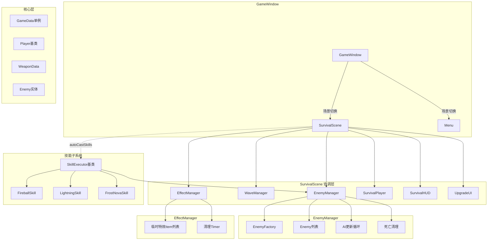
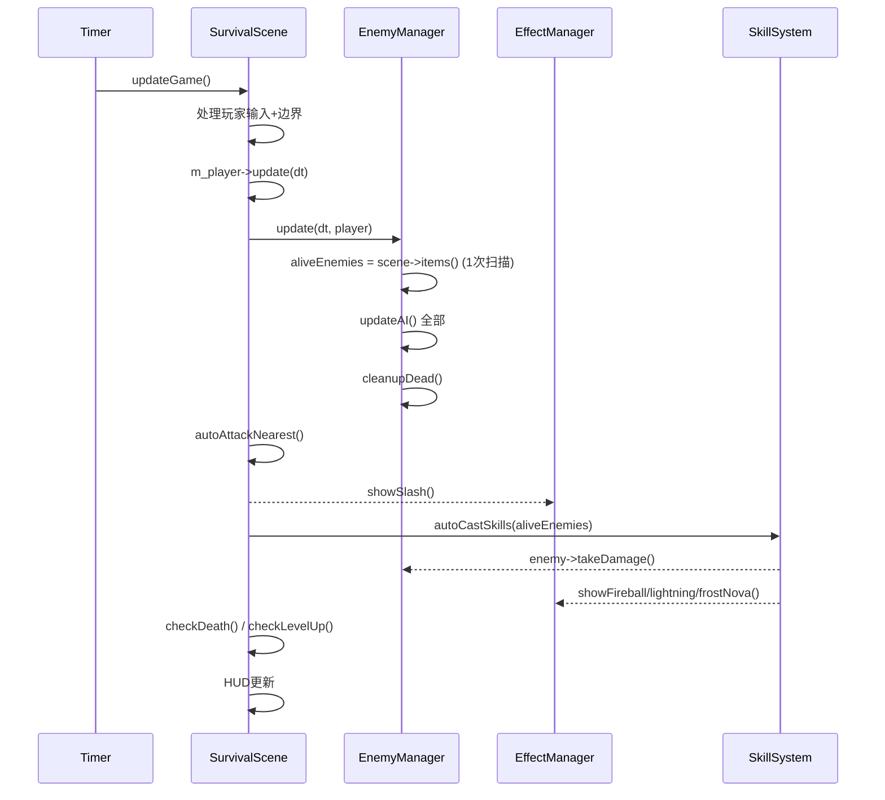

# DESIGN — 架构与代码规范整顿

## 1. 整体架构图



## 2. 新增/拆分模块

### 2.1 EffectManager (`src/survival/EffectManager.h/.cpp`)

```
职责: 管理所有临时战斗特效的创建和自动清理
所属: SurvivalScene持有 unique_ptr<EffectManager>
生命周期: 与Scene相同。析构时自动清理所有pending timer
```

接口:
```cpp
namespace pixel_hero::survival {
class EffectManager : public QObject {
    Q_OBJECT
public:
    explicit EffectManager(QGraphicsScene* scene);
    
    void showSlash(QPointF pos);
    void showFireball(QPointF from, QPointF to);
    void showLightning(QPointF from, QPointF to);
    void showFrostNova(QPointF center, float radius);
    
private:
    QGraphicsScene* m_scene; // 非所有者
    // 不需要额外存储 — 特效item由QGraphicsScene管理
    // QTimer回调用QPointer<QGraphicsScene>防UAF
};
}
```

**关键安全改进**: QTimer回调中不捕获raw this，改用 `QPointer<QGraphicsScene>` 弱引用Scene，回调时检查有效性。

### 2.2 EnemyManager (`src/survival/EnemyManager.h/.cpp`)

```
职责: 敌人生命周期管理(生成/更新/清理)
所属: SurvivalScene持有 unique_ptr<EnemyManager>
```

接口:
```cpp
namespace pixel_hero::survival {
class EnemyManager : public QObject {
    Q_OBJECT
public:
    EnemyManager(WaveManager* wm, QGraphicsScene* scene);
    
    void update(qreal dt, SurvivalPlayer* player);
    QList<Enemy*> aliveEnemies() const;
    Enemy* findNearest(QPointF pos, qreal range) const;
    int totalKills() const;
    
private:
    WaveManager* m_waveManager;
    QGraphicsScene* m_scene;
    int m_totalKills;
    
    void cleanupDead();
    void updateAI(qreal dt, SurvivalPlayer* player);
};
}
```

### 2.3 技能执行器 (`src/survival/skills/`)

```
职责: 每种技能的攻击逻辑+特效
模式: 基类+策略子类
```

```cpp
namespace pixel_hero::survival {
class SkillExecutor {
public:
    virtual ~SkillExecutor() = default;
    virtual void execute(const ActiveSkill& skill,
                         QPointF playerPos,
                         QList<Enemy*>& enemies,
                         EffectManager* fx) = 0;
};

class FireballSkill : public SkillExecutor { ... };
class LightningSkill : public SkillExecutor { ... };
class FrostNovaSkill : public SkillExecutor { ... };

// 工厂
SkillExecutor* createExecutor(const QString& skillId);
}
```

## 3. 命名空间结构

```
pixel_hero
├── entities/   Enemy, Player, Weapon
├── survival/   SurvivalScene, SurvivalPlayer, WaveManager, EnemyManager, EffectManager, SkillExecutor
├── ui/         Menu, CharacterSelectUI, WeaponSelectUI, SelectableListBase, SaveLoadUI
└── utils/      GameData, ResourceManager, AnimationManager
```

## 4. 数据流 (每帧)



## 5. 关键常量提取

```cpp
// config/GameConfig.h
namespace pixel_hero::config {
    constexpr QRectF SCENE_RECT{0, 0, 800, 600};
    constexpr float PLAYER_PADDING = 24.0;
    constexpr float ATTACK_RANGE = 60.0;
    constexpr int MAX_ALIVE_ENEMIES = 30;
    constexpr int GAME_TICK_MS = 16;  // ~60fps
}
```

## 6. 异常处理

| 场景 | 策略 |
|------|------|
| Scene析构时EffectManager有pending特效 | EffectManager析构 → 所有QPointer检查失败 → 安全放弃 |
| 敌人死亡时闪烁帧未结束 | flashTimer递减到0时检查isAlive()，安全跳过 |
| items()返回超大列表 | MAX_ALIVE_ENEMIES限制 + EnemyManager内部提前return |
