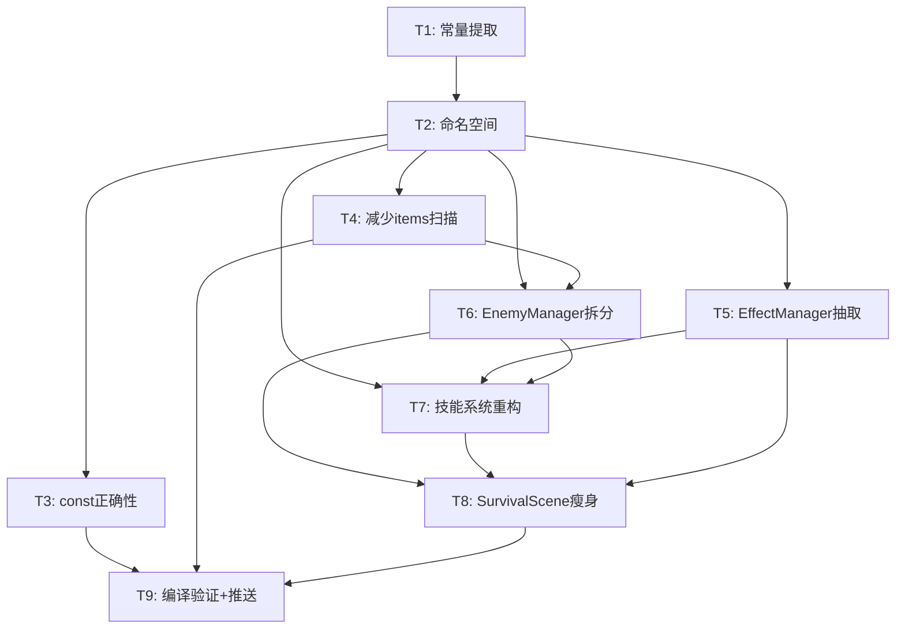

# TASK — 架构与代码规范整顿

## 任务依赖图

---

## T1: 常量提取 + 魔法数字消除

| 输入 | `*` 所有文件 |
|------|-------------|
| 输出 | `src/config/GameConfig.h` |
| 验收 | 全局无 `800` `600` `24.0` `60.0` `16` `30` 等散落常量 |

## T2: 命名空间包围

| 输入 | 所有 .h/.cpp |
|------|-------------|
| 输出 | `namespace pixel_hero {` / 子命名空间 |
| 验收 | 编译通过；所有类型在命名空间内；类名无需修改 |

## T3: const 正确性

| 输入 | 所有 getter 方法 |
|------|-----------------|
| 输出 | `const` 修饰符 + 消除 `const_cast` |
| 验收 | `aliveEnemies()`/`health()`/`attack()` 等全部加 const |

## T4: 减少 QGraphicsScene::items() 扫描次数

| 输入 | `SurvivalScene::updateGame()` |
|------|------------------------------|
| 输出 | 1次扫描 → 局部变量传递 |
| 验收 | `items()` 在 `updateGame` 中只出现1次 |

## T5: EffectManager 抽取

| 输入 | `SurvivalScene::showSlashEffect/showFireballEffect/showLightningEffect/showFrostNovaEffect` |
|------|-------------------------------------------------------------------------------------------|
| 输出 | `src/survival/EffectManager.h/.cpp` |
| 验收 | 4个特效方法从SurvivalScene移除；QTimer回调用QPointer防UAF |

## T6: EnemyManager 拆分

| 输入 | `SurvivalScene::cleanupDeadEnemies()` + AI更新循环 |
|------|---------------------------------------------------|
| 输出 | `src/survival/EnemyManager.h/.cpp` |
| 验收 | SurvivalScene不再直接管理敌人列表 |

## T7: 技能系统策略化

| 输入 | `SurvivalScene::autoCastSkills()` 中 if/else 串 |
|------|------------------------------------------------|
| 输出 | `src/survival/skills/SkillExecutor.h` + 3个子类 |
| 验收 | 加新技能=新增SkillExecutor子类+注册，不改SurvivalScene |

## T8: SurvivalScene 瘦身

| 输入 | T5+T6+T7完成后的SurvivalScene |
|------|------------------------------|
| 输出 | `<250行` 的 SurvivalScene.cpp |
| 验收 | SurvivalScene仅负责：协调整体流程+升级UI连接+HUD更新，具体逻辑全部委托给子模块 |

## T9: 编译验证 + 推送

| 输入 | T1-T8全部完成 |
|------|-------------|
| 输出 | 编译通过 + git push |
| 验收 | `-Wall -Wextra` 无新增警告；游戏功能正常 |
