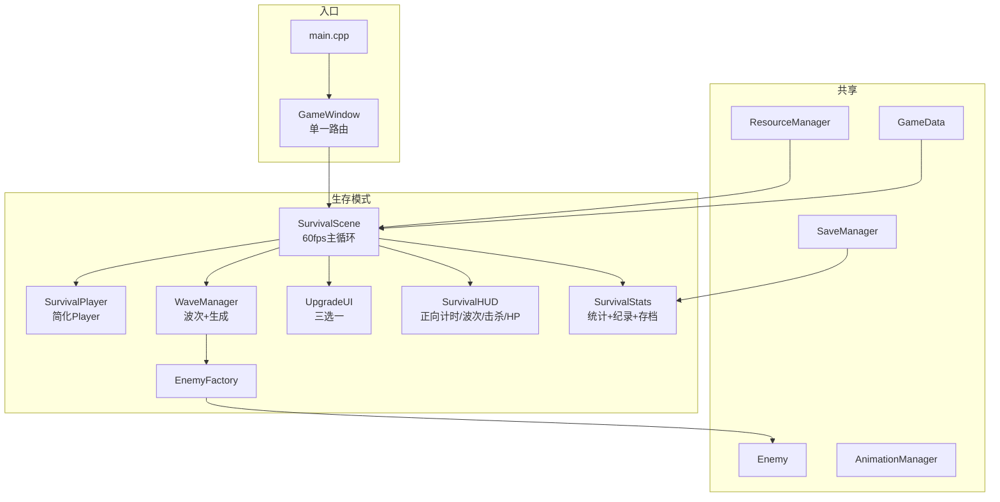
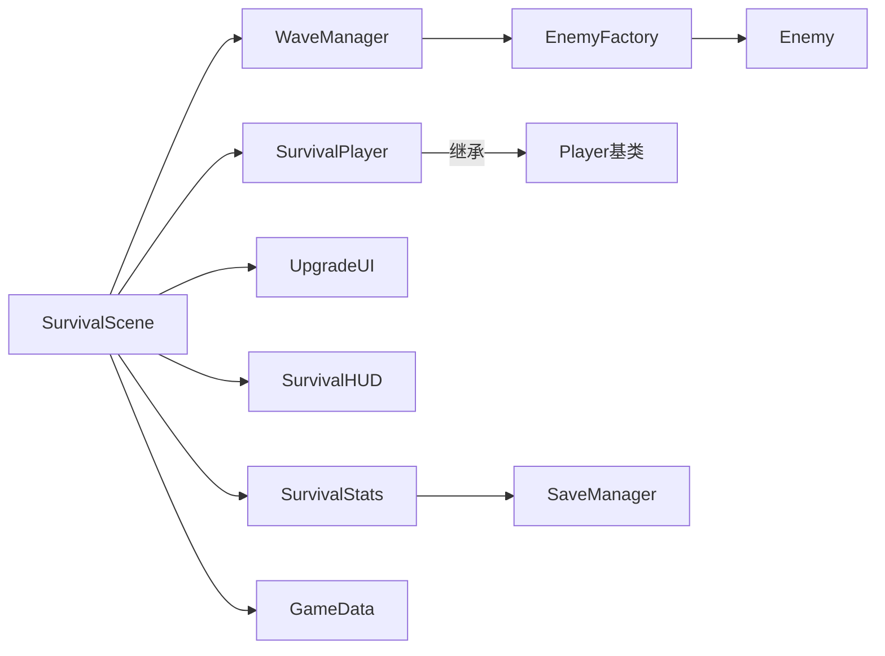
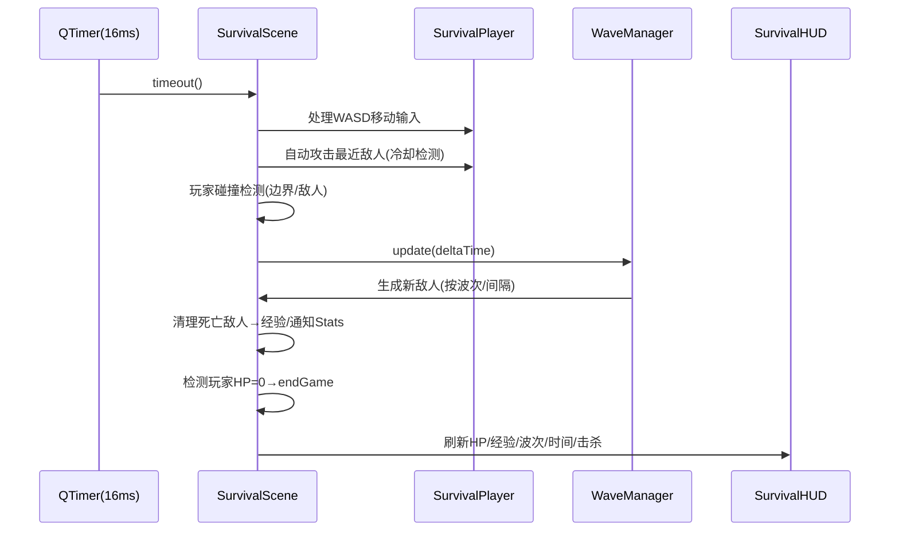
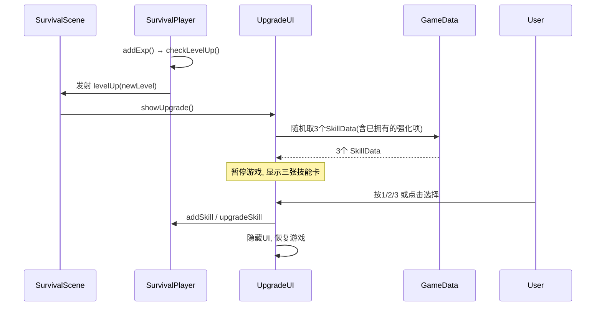
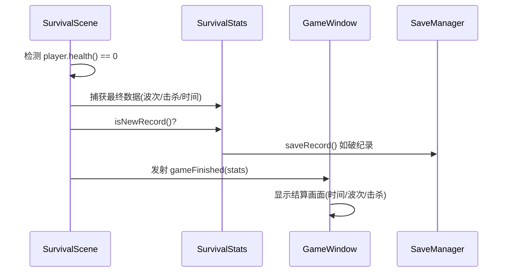
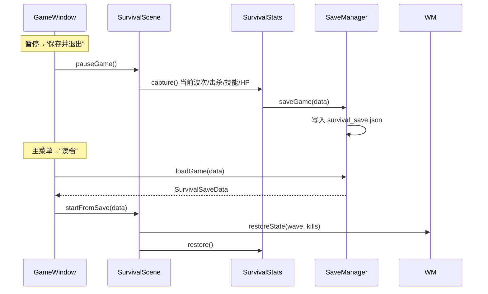

# 生存割草模式 — DESIGN 文档 (修订版)

**项目**: 像素勇者 (Pixel Hero Adventure)
**文档版本**: DESIGN V2.0
**修订日期**: 2026-06-10
**修订原因**: 删除故事模式、胜利改为死亡结算、删除装备系统
**阶段**: 阶段2 — 架构阶段 (Architect)
**前置文档**: [CONSENSUS_生存割草模式.md](./CONSENSUS_生存割草模式.md)

---

## 一、整体架构图 (简化)



## 二、分层设计 (简化)

```
┌─────────────────────────────────────┐
│              入口层                  │
│    main.cpp → GameWindow             │
│    (仅路由到 SurvivalScene)          │
├─────────────────────────────────────┤
│              生存层                  │
│    SurvivalScene (主循环)            │
│    ├── SurvivalPlayer (简化Player)    │
│    ├── WaveManager → EnemyFactory    │
│    ├── UpgradeUI                     │
│    ├── SurvivalHUD                   │
│    └── SurvivalStats                 │
├─────────────────────────────────────┤
│              共享层                  │
│    Enemy / GameData / SaveManager    │
│    ResourceManager / AnimationMgr    │
└─────────────────────────────────────┘
```

### 组件职责

| 组件 | 职责 | 关键方法 |
|------|------|---------|
| `GameWindow` | 入口路由、键鼠分发、存档桥接 | `startGame()`, `resumeSavedGame()` |
| `SurvivalScene` | 60fps循环、碰撞检测、清理、死亡/升级分发 | `updateGame()`, `endGame()` |
| `SurvivalPlayer` | 移动/战斗/技能管理，无装备 | `addSkill()`, `upgradeSkill()` |
| `WaveManager` | 波次推进、渐进生成、难度曲线 | `update()`, `spawnEnemy()` |
| `UpgradeUI` | 三选一弹窗 | `showUpgrade()` |
| `SurvivalHUD` | 正向计时/波次/击杀/HP/技能显示 | `updateHUD()` |
| `SurvivalStats` | 局内统计 + JSON纪录 + 中途存档 | `save()`, `load()`, `isNewRecord()` |
| `EnemyFactory` | 6种敌人创建 | `createEnemy(id)` |

---

## 三、模块依赖



### 依赖规则

| 规则 | 说明 |
|------|------|
| 单向依赖 | 上层→下层 |
| 共享层不依赖生存层 | Enemy/GameData 不引用 Survival* |
| 生存层可依赖共享层 | SurvivalScene 可引用 Enemy/GameData |
| 无故事模式 | 已删除全部故事相关文件 |

---

## 四、数据流

### 4.1 游戏循环 (60fps)



### 4.2 升级选技能



### 4.3 死亡结算



### 4.4 中途存档



---

## 五、核心接口 (简化)

### 5.1 SurvivalScene

```cpp
class SurvivalScene : public QGraphicsScene {
    Q_OBJECT
public:
    SurvivalScene(QObject* parent = nullptr);

    void startGame();
    void startFromSave(const SurvivalSaveData& data);
    void pauseGame();
    void resumeGame();
    void endGame();

    SurvivalPlayer* player() const;
    WaveManager* waveManager() const;

signals:
    void gameFinished(int wave, int kills, float time, bool isNewRecord);
    void levelUp(int newLevel);
};
```

### 5.2 SurvivalPlayer (无装备玩家)

```cpp
class SurvivalPlayer : public Player {
public:
    SurvivalPlayer(QGraphicsItem* parent = nullptr);
    
    // 技能
    void addSkill(const QString& id, int level);
    void upgradeSkill(const QString& id, int newLevel);
    int skillLevel(const QString& id) const;
    
    // 属性计算(基础值+被动加成, 无装备)
    int attack() const override;
    int speed() const override;
    
    // 帧更新(技能冷却)
    void update(qreal deltaTime) override;
    
    struct ActiveSkill {
        QString skillId;
        int level;
        int damage;
        float cooldown;
        float currentCooldown;
        int extra;
    };
    
    QList<ActiveSkill> activeSkills() const;
    
signals:
    void leveledUp(int newLevel);
};
```

### 5.3 WaveManager — 同 V1.0 DESIGN

### 5.4 UpgradeUI — 同 V1.0 DESIGN

### 5.5 SurvivalHUD

```cpp
class SurvivalHUD : public QObject, public QGraphicsItem {
    Q_OBJECT
public:
    SurvivalHUD(QGraphicsItem* parent = nullptr);
    
    void bind(SurvivalPlayer* player, WaveManager* waveManager);
    void updateHUD();
    
    QRectF boundingRect() const override;
    void paint(QPainter*, const QStyleOptionGraphicsItem*, QWidget*) override;
};
```

### 5.6 SurvivalStats

```cpp
class SurvivalStats : public QObject {
    Q_OBJECT
public:
    void addKill();
    void setWave(int w);
    void setTime(float t);
    void capturePlayerSkills(const QList<QPair<QString,int>>& skills);
    
    bool isNewRecord() const;
    void saveRecord();
    void saveCurrentGame();
    bool loadSavedGame(SurvivalSaveData& data);
    bool hasSavedGame() const;
};
```

---

## 六、异常处理 (不变)

| 类型 | 策略 |
|------|------|
| 空指针 | 防御性 return |
| JSON解析失败 | 硬编码默认技能/波次数据 |
| 资源加载失败 | 回退纯色矩形 |
| 同屏上限 | MAX_ALIVE_ENEMIES = 30 |
| 存档损坏 | 删除坏档，无存档时不显示读档按钮 |

---

## 七、HUD 布局 (更新)

```
┌──────────────────────────────────────────────────┐
│ Lv.5  ████████░░░░  HP 80/100        存活 12:34  │
│        ████████░░░░  XP 45/80         Wave 8     │
│  技能: 🔥火球Lv3  ⚡闪电Lv2                      │
│  击杀: 42                                        │
│  WASD移动  |  自动攻击临近敌人                   │
└──────────────────────────────────────────────────┘
```

> 时间从 00:00 开始正向计时，无上限。

---

## 八、关键数值曲线

### 敌人密度

```
30 │                                    ╭────
25 │                              ╭─────╯
20 │                        ╭─────╯
15 │                  ╭─────╯
10 │            ╭─────╯
 5 │──────╭────╯
 0 └──────┴──────┴──────┴──────┴──────┴──────→ 时间
   0:00   2:30   5:00   7:30  10:00  12:30  ...
```

### 升级曲线

```
12 │                                              ●
10 │                                         ●
 8 │                                   ●
 6 │                             ●
 4 │                       ●
 2 │                 ●
 1 ●──────┴──────┴──────┴──────┴──────┴──────→ 时间
   0:00   2:30   5:00   7:30  10:00  12:30  ...
```

### 关键波次

| 波次 | 时间 | 事件 |
|:----:|------|------|
| 1 | 0:00 | 史莱姆 × 8 |
| 2 | 0:30 | 哥布林加入 |
| 5 | 2:20 | 精英 × 1 |
| 6 | 3:00 | 骷髅加入 |
| 8 | 5:00 | 蝙蝠加入 |
| 10 | 6:00 | Boss龙 × 1 |
| 13 | 8:30 | 精英 × 3 |
| 16 | 10:30 | Boss × 1 |
| 20 | 14:00 | Boss+精英混合 |

---

## 九、性能优化 (不变)

| 优化 | 说明 |
|------|------|
| 对象池 | Enemy 复用 |
| 视口裁剪 | 出界不渲染 |
| 缓存绘制 | DeviceCoordinateCache |
| 空间分区 | 4×3 网格碰撞检测 |
| 批量清理 | 帧末统一 delete 死敌 |

---

**文档状态**: ✅ V2.0 已完成
**下一步**: 重新生成 TASK 文档
