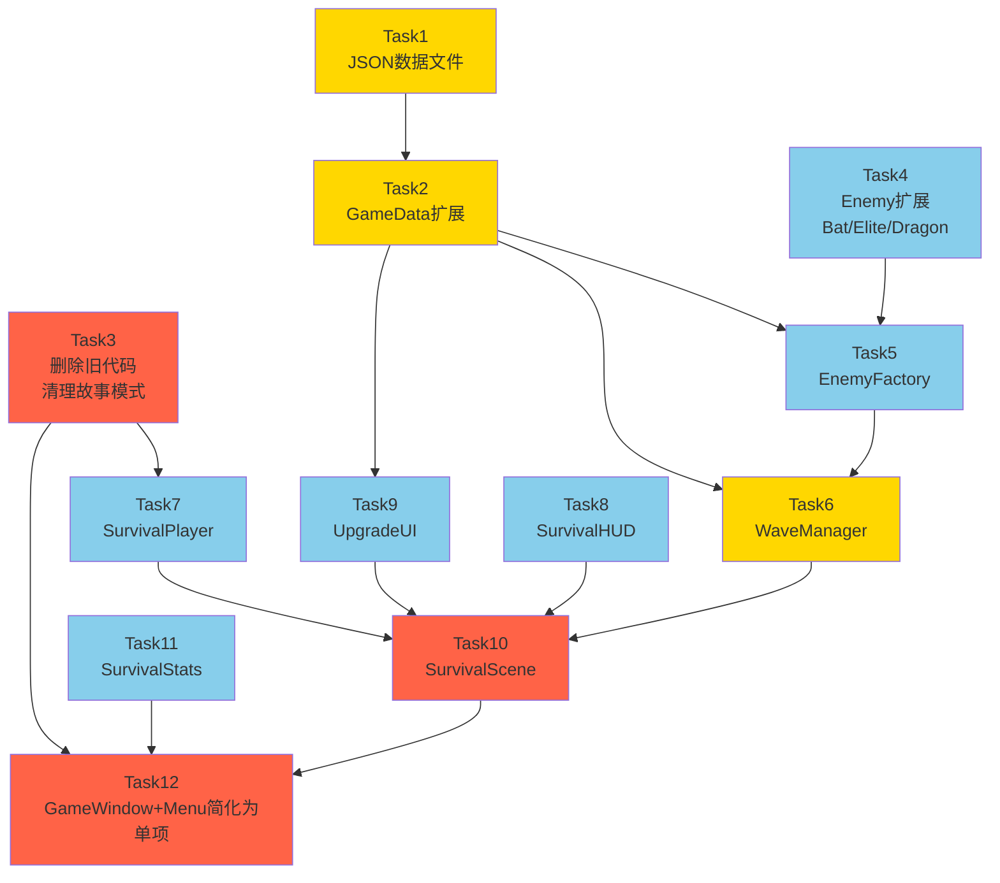

# 生存割草模式 — TASK 原子任务文档 (修订版)

**项目**: 像素勇者 (Pixel Hero Adventure)
**文档版本**: TASK V2.0
**修订日期**: 2026-06-10
**修订原因**: 删除故事模式、胜利改为死亡结算、删除装备系统
**阶段**: 阶段3 — 原子化阶段 (Atomize)
**前置文档**: [DESIGN_生存割草模式.md](./DESIGN_生存割草模式.md)

---

## 一、任务拆分总览

```
T1_JSON数据 ──┬── T2_GameData扩展
              │
T3_删除旧代码 ─┼── T4_Enemy扩展 ── T5_EnemyFactory
              │                          │
              │                   T6_WaveManager
              │
T7_SurvivalPlayer (简化Player)
              │
T8_SurvivalHUD ──┐
              │   │
T9_UpgradeUI ──┤   │
              │   │
           ┌──┴───┴──── T10_SurvivalScene (集成)
           │                  │
    T12_GameWindow+Menu ─────┘
```

## 二、任务依赖图



> 红色=关键集成, 黄色=数据层, 蓝色=实体/UI层

---

## 三、原子任务详述

---

### Task 1: JSON 数据文件

| 属性 | 内容 |
|------|------|
| **优先级** | P0 |
| **依赖** | 无 |
| **操作** | 纯新建文件 |

#### 输出

| 文件 | 说明 |
|------|------|
| `resources/data/skills.json` | 5技能 × 5等级 |
| `resources/data/survival_waves.json` | 20波配置 + 6敌人基础属性 |

#### 验收

- [ ] JSON 格式合法
- [ ] skills.json: fireball/lightning/frost_nova/attack_boost/speed_boost，每个5级
- [ ] survival_waves.json: 20波，5/10/13/16/20波有精英/Boss标记
- [ ] 6种敌人 baseStats 完整

---

### Task 2: GameData 扩展

| 属性 | 内容 |
|------|------|
| **优先级** | P0 |
| **依赖** | Task 1 |
| **文件** | `src/utils/GameData.h/cpp` |

#### 新增方法

```cpp
bool loadSkillData(const QString& path);
bool loadWaveData(const QString& path);
const SkillData* getSkillById(const QString& id) const;
QList<SkillData> allSkills() const;
QList<WaveConfig> waveConfigs() const;
```

#### 验收

- [ ] loadSkillData 加载5个技能
- [ ] getSkillById("fireball") 返回5级完整数据
- [ ] loadWaveData 加载20波
- [ ] JSON异常时回退硬编码默认值

---

### Task 3: 删除旧代码 + 改造 Player

| 属性 | 内容 |
|------|------|
| **优先级** | P0 |
| **依赖** | 无 |
| **操作** | 删除14个文件 + 改造1个文件 |

#### 3.1 删除文件 (28个 .h+.cpp)

```
src/GameScene.h/cpp
src/entities/Item.h/cpp
src/entities/Armor.h/cpp
src/entities/NPC.h/cpp
src/battle/BattleSystem.h/cpp
src/battle/Weapon.h/cpp
src/map/MapManager.h/cpp
src/map/Tile.h/cpp
src/map/CollisionLayer.h/cpp
src/ui/HUD.h/cpp
src/ui/Inventory.h/cpp
```

#### 3.2 改造 Player

| 文件 | 改动 |
|------|------|
| `src/entities/Player.h` | 删除 Weapon\*/Armor\*/Inventory 成员及方法，删除 equipWeapon/equipArmor/unEquip\* 等 |
| `src/entities/Player.cpp` | 删除以上对应实现 |

简化后 Player 保留：
- 基础属性: m_health, m_maxHealth, m_attack, m_defense, m_speed
- 移动: move(Direction), pos(), setPos()
- 战斗: takeDamage(), attack(), isAlive()
- 经验: m_exp, m_level, addExp()

#### 验收

- [ ] 14个旧文件全部删除
- [ ] Player 不包含 Weapon\*/Armor\*/inventory 成员
- [ ] Player 编译通过 (无缺失引用)
- [ ] pixel_hero.pro 中移除旧文件路径

---

### Task 4: Enemy 扩展

| 属性 | 内容 |
|------|------|
| **优先级** | P0 |
| **依赖** | Task 3 |
| **文件** | `src/entities/Enemy.h` |

#### 改动

EnemyType 枚举新增：
```cpp
enum EnemyType {
    GOBLIN, SLIME, SKELETON,    // 现有
    BAT, GOBLIN_ELITE, DRAGON    // 新增
};
```

> 不需要修改 Enemy.cpp 核心逻辑，因为属性由 EnemyFactory 从 JSON 注入，AI 行为复用现有5状态FSM。

#### 验收

- [ ] EnemyType 含 6 种枚举值
- [ ] 编译通过

---

### Task 5: EnemyFactory

| 属性 | 内容 |
|------|------|
| **优先级** | P0 |
| **依赖** | Task 2 + Task 4 |
| **文件** | `src/survival/EnemyFactory.h/cpp` (新建) |

#### 接口

```cpp
class EnemyFactory {
public:
    EnemyFactory();
    Enemy* createEnemy(const QString& id, qreal x, qreal y);
    void loadStats(const QJsonObject& statsJson);
private:
    QMap<QString, EnemyStats> m_stats;
};
```

#### 实现

- slime/goblin/skeleton → 复用现有精灵和颜色
- bat → 新精灵(飞行)、高速低血
- goblin_elite → 哥布林精灵放大、高属性
- dragon → 大精灵、Boss级属性
- 属性全部从 survival_waves.json 的 enemyBaseStats 读取

#### 验收

- [ ] createEnemy("slime") → hp=20
- [ ] createEnemy("bat") → spd=3.0, hp=15
- [ ] createEnemy("dragon") → hp=500
- [ ] createEnemy("goblin_elite") → hp=200

---

### Task 6: WaveManager

| 属性 | 内容 |
|------|------|
| **优先级** | P0 |
| **依赖** | Task 2 + Task 5 |
| **文件** | `src/survival/WaveManager.h/cpp` (新建) |

#### 核心逻辑

```cpp
class WaveManager : public QObject {
    Q_OBJECT
public:
    void start();
    void update(qreal dt);
    void restoreState(int wave, int kills);
    int currentWave() const;
    int totalKills() const;
    float elapsedTime() const;

signals:
    void waveChanged(int wave);
    void bossSpawned(Enemy* boss);
};
```

- 每帧累积时间 → 检查波次切换 → 按间隔生成敌人
- 生成位置：场景边缘 150-400px 随机点
- 同屏上限 30 个

#### 验收

- [ ] 开局生成史莱姆 × 8 (间隔3秒)
- [ ] 第5波触发 waveChanged(5) + 精英
- [ ] 第10波触发 bossSpawned
- [ ] 同屏 ≤ 30
- [ ] restoreState(5, 42) 恢复到波次5，击杀42

---

### Task 7: SurvivalPlayer

| 属性 | 内容 |
|------|------|
| **优先级** | P0 |
| **依赖** | Task 3 (Player 已简化) |
| **文件** | `src/survival/SurvivalPlayer.h/cpp` (新建) |

#### 接口

```cpp
class SurvivalPlayer : public Player {
    Q_OBJECT
public:
    SurvivalPlayer(QGraphicsItem* parent = nullptr);
    
    void addSkill(const QString& id, int level);
    void upgradeSkill(const QString& id, int newLevel);
    int  skillLevel(const QString& id) const;
    QList<ActiveSkill> activeSkills() const;
    
    int attack() const override;   // 基础10 + 被动加成
    int speed() const override;    // 基础3 + 被动加成
    
    void update(qreal deltaTime) override;

signals:
    void leveledUp(int newLevel);
};
```

- 构造: HP=100, attack=10, defense=3, speed=3
- addSkill → 查 skills.json 获取级数值 → 加入列表
- upgradeSkill → 更新到新等级数值
- update(dt) → 遍历技能，冷却倒计时，到期自动释放
- addExp → 检查是否升级 → 发射 leveledUp

#### 验收

- [ ] addSkill("attack_boost", 3) → attack() == 28
- [ ] addSkill("speed_boost", 2) → speed() == 5
- [ ] 技能冷却到期自动释放
- [ ] 升级发射 leveledUp

---

### Task 8: SurvivalHUD

| 属性 | 内容 |
|------|------|
| **优先级** | P0 |
| **依赖** | Task 6 + Task 7 (接口) |
| **文件** | `src/survival/SurvivalHUD.h/cpp` (新建) |

#### 接口

```cpp
class SurvivalHUD : public QObject, public QGraphicsItem {
    Q_OBJECT
public:
    void bind(SurvivalPlayer* player, WaveManager* waveManager);
    void updateHUD();
};
```

#### HUD 布局 (正向计时)

```
Lv.5  ████████░░░░ HP 80/100        存活 12:34
       ████████░░░░ XP 45/80        Wave 8
技能: 火球Lv3  闪电Lv2
击杀: 42
WASD移动 | 自动攻击临近敌人
```

#### 验收

- [ ] HP血条 + 数值
- [ ] 等级 + 经验条
- [ ] 正向计时 mm:ss
- [ ] 波次 Wave X
- [ ] 击杀数
- [ ] 技能列表
- [ ] 操作提示

---

### Task 9: UpgradeUI

| 属性 | 内容 |
|------|------|
| **优先级** | P0 |
| **依赖** | Task 2 (技能数据) |
| **文件** | `src/survival/UpgradeUI.h/cpp` (新建) |

#### 接口

```cpp
class UpgradeUI : public QObject, public QGraphicsItem {
    Q_OBJECT
public:
    void showUpgrade(const QList<SkillData>& options);
    void hide();
    void selectOption(int index);  // 1/2/3

signals:
    void skillSelected(const QString& skillId);
};
```

- 3张卡片: 110/310/510, y=160，卡宽180×200
- 显示: 技能名/当前等级/下等级效果/满级显示"已满"
- 键盘 1/2/3 或 A/S/D 选
- 选择后 hide → 恢复游戏

#### 验收

- [ ] 升级弹出3张可选卡片
- [ ] 每张显示名称+等级+描述
- [ ] 按1或A选第一张
- [ ] 满级显示"已满"
- [ ] 选择后隐藏，游戏恢复

---

### Task 10: SurvivalScene (核心集成)

| 属性 | 内容 |
|------|------|
| **优先级** | P0 |
| **依赖** | Task 6 + 7 + 8 + 9 |
| **文件** | `src/survival/SurvivalScene.h/cpp` (新建) |

#### 接口

```cpp
class SurvivalScene : public QGraphicsScene {
    Q_OBJECT
public:
    void startGame();
    void startFromSave(const SurvivalSaveData& data);
    void pauseGame();
    void resumeGame();
    void endGame();  // 仅死亡触发

signals:
    void gameFinished(int wave, int kills, float time, bool isNewRecord);
    void levelUp(int newLevel);
};
```

#### 每帧逻辑

```cpp
void SurvivalScene::updateGame(qreal dt) {
    // 1. 处理WASD输入 → 移动玩家
    // 2. 玩家自动攻击最近敌人(冷却检查)
    // 3. 玩家碰撞边界(0-800, 0-600)
    // 4. WaveManager::update(dt)
    // 5. 清理死亡敌人 → 经验给玩家 / 通知 Stats
    // 6. 检测 HP=0 → endGame()
    // 7. HUD updateHUD()
}
```

#### 验收

- [ ] 开局后正常运行所有子系统
- [ ] HP=0 触发 endGame → gameFinished 信号
- [ ] 升级触发 upgradeUI
- [ ] 编译零错误

---

### Task 11: SurvivalStats

| 属性 | 内容 |
|------|------|
| **优先级** | P1 |
| **依赖** | Task 3 (SaveManager 保留) |
| **文件** | `src/survival/SurvivalStats.h/cpp` (新建) |

#### 数据

```cpp
struct SurvivalSaveData {
    int currentWave;
    int totalKills;
    float elapsedTime;
    int playerLevel;
    int playerHealth;
    int playerMaxHealth;
    int playerExp;
    QList<QPair<QString,int>> skills;
};

// 跨局纪录
int recordWave;
int recordKills;
float recordTime;
```

#### 验收

- [ ] 中途退出 → 存 survival_save.json → 读档恢复
- [ ] 破纪录显示"新纪录!"
- [ ] 无存档时不显示"读档"按钮

---

### Task 12: GameWindow 简化 + Menu 更新

| 属性 | 内容 |
|------|------|
| **优先级** | P0 |
| **依赖** | Task 3 + 10 + 11 |
| **文件** | `src/GameWindow.h/cpp`, `src/ui/Menu.h/cpp` |

#### GameWindow 改动

- 删除故事模式相关: `m_scene`(GameScene), `m_mapManager`, `m_battleSystem`, `m_hud`, `m_inventory`, NPC/Item 引用
- 简化为: `m_survivalScene` + `m_menu` + `m_gameController`
- `startGame()` → 直接 `m_survivalScene->startGame()`
- 状态机: `MainMenu → Playing → Paused/GameOver`

#### Menu 改动

- 删除"故事模式"选项
- 保留: **新游戏 / 读档 / 退出**
- 读档仅在有存档时可用

#### 验收

- [ ] 启动主菜单3选项
- [ ] 选"新游戏"进入生存模式
- [ ] 死亡后显示结算画面
- [ ] "读档"无存档时不响应
- [ ] ESC暂停 → "保存并退出"
- [ ] 编译零错误

---

### Task 13: 编译配置更新

| 属性 | 内容 |
|------|------|
| **优先级** | P0 |
| **依赖** | 以上全部 |
| **文件** | `pixel_hero.pro`, `resources.qrc` |

#### pixel_hero.pro 改动

- 删除旧文件的 SOURCES/HEADERS
- 新增 survival 目录下所有文件
- 新增 `src/survival/` 到 INCLUDEPATH

#### resources.qrc 改动

- 删除 NPC/Tile/UI/NPC/Item 相关 PNG 引用
- 新增 `resources/data/skills.json`
- 新增 `resources/data/survival_waves.json`

#### 验收

- [ ] qmake 成功
- [ ] mingw32-make 零错误
- [ ] 程序正常启动

---

## 四、执行顺序

```
第1批(并行): T1 JSON数据, T3 删除旧代码+改造Player
             ↓
第2批(并行): T2 GameData扩展(依赖T1), T4 Enemy扩展(依赖T3)
             ↓
第3批:       T5 EnemyFactory(依赖T2+T4)
             ↓
第4批(并行): T6 WaveManager(依赖T2+T5), T7 SurvivalPlayer(依赖T3), T9 UpgradeUI(依赖T2)
             ↓
第5批:       T8 SurvivalHUD(依赖T6+T7接口)
             ↓
第6批:       T10 SurvivalScene(集成T6+T7+T8+T9)
             ↓
第7批(并行): T11 SurvivalStats, T12 GameWindow+Menu简化
             ↓
第8批:       T13 编译配置更新 → 编译验证
```

---

## 五、改动统计

| 操作 | 文件数 | 代码量 |
|:----:|:------:|:------:|
| 删除 | 28个 .h/.cpp | ~2500行(删除) |
| 新建 | 16个 .h/.cpp + 2个 .json | ~800行(新增) |
| 改造 | 4个 (Player/GameWindow/Menu/pixel_hero.pro) | ~150行(改动) |
| **净变化** | - | **约-1700行代码** |

---

**文档状态**: ✅ V2.0 已完成
**下一步**: 进入阶段4 — Approve (审批确认)
